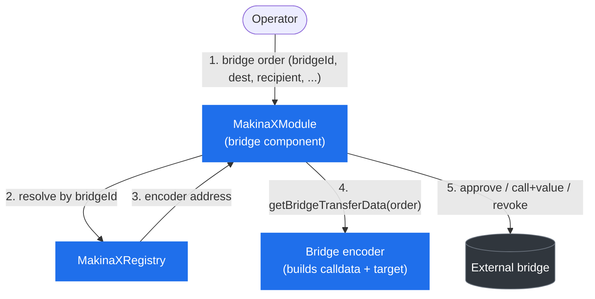

# Token Bridging

Bridging lets a strategy move tokens to another chain. MakinaX bridging is **outbound only**. The module can send tokens cross-chain, but it does not track, value, or reconcile anything on the destination chain. There is no cross-chain accounting in MakinaX. For the exact rules, see [`BridgeComponent`](/contracts/module-components/abstract.BridgeComponent) in the Contracts reference.

## The encoder model

Every bridge exposes a different interface. Rather than hard-code each one into the module, MakinaX handles them through **bridge encoders**: shared, single-instance contracts, one per bridge. Each encoder stores miscellaneous routing configuration data and crafts the calldata for requested transfers.

In order to send a transfer, the module pulls the input token from the Safe onto the module, requests calldata and target from the relevant encoder, and then performs the external call (approving and revoking around it if the bridge needs an allowance, and forwarding any required native value).

The encoders only **compute** calldata. They cannot move funds. The actual transfer happens when the module calls the external bridge with the encoder's output.

## Mode-gated guards

In `FENCED` or `WALLED` mode, outbound transfers enforce:

- **Recipient whitelisting.** The recipient on the destination chain must be whitelisted for that specific destination chain ID.
- **Value loss limit.** The minimum output amount must be within `maxBridgeLossBps` of the input amount. This is a direct amount comparison rather than an oracle-priced one, so it assumes the input and output tokens are homologous: the same underlying value, one to one, with the same number of decimals. Unlike the swap and position parameters, `maxBridgeLossBps` is not part of the deployment parameters and starts at zero, the strictest setting, so a guarded module requires full-value output on every bridge transfer until the Safe sets a per-bridge tolerance.
- **Route or OFT registration.** Bridge-specific registration must exist (a registered route for Across V4, a registered OFT for LayerZero V2).
- **Cooldown.** Each bridge ID has its own independent cooldown clock. A transfer through a bridge is rejected until that bridge's cooldown has elapsed since its previous transfer.

:::warning[Recipients must be plain custody addresses]
A whitelisted recipient must be an address the same party controls and can custody the asset with on the destination chain. It must never be a MakinaX module address on any chain. A module set as a recipient can have a pending inbound transfer settled into it by an attacker who gains control mid-operation, inflating its measured balances and masking a loss elsewhere. See the [Risk Model](/concepts/risk-model).
:::

## Supported bridges

| Bridge             | Encoder                                                                                    | Routing model                                                            |
| ------------------ | ------------------------------------------------------------------------------------------ | ------------------------------------------------------------------------ |
| **Across V4**      | [`AcrossV4BridgeEncoder`](/contracts/bridge-encoders/contract.AcrossV4BridgeEncoder)       | Input-to-output token routes, per destination chain.                     |
| **Circle CCTP V2** | [`CctpV2BridgeEncoder`](/contracts/bridge-encoders/contract.CctpV2BridgeEncoder)           | Maps EVM chain IDs to CCTP domains.                                      |
| **LayerZero V2**   | [`LayerZeroV2BridgeEncoder`](/contracts/bridge-encoders/contract.LayerZeroV2BridgeEncoder) | OFT standard. Chain-ID-to-endpoint-ID mappings and an allowlist of OFTs. |

## The native gas buffer

LayerZero V2 transfers require a native gas fee paid alongside the transfer. The module therefore holds a small native balance as a buffer, and the fee is paid from it. Across V4 and CCTP V2 transfers carry no native value. Because the module is meant to be empty otherwise, the Safe can recover this native balance at any time with `sweepNative`.

## Per-bridge fields and checks

Every order carries common fields (input token, amount, destination chain, recipient, minimum output) plus bridge-specific `extraData`. What the Operator chooses, and what is fixed by registration, differs per bridge:

| Bridge           | Operator supplies (`extraData`) | Registered by infrastructure                  |
| ---------------- | ------------------------------- | --------------------------------------------- |
| **Across V4**    | output token, fill deadline     | input-to-output routes, per destination chain |
| **CCTP V2**      | finality threshold              | EVM chain ID to CCTP domain                   |
| **LayerZero V2** | OFT, gas, max fee               | endpoint IDs, allowed OFTs                    |

The encoder then checks, per bridge:

- **Across V4**: while in `FENCED` or `WALLED` mode, the route (input token, destination, output token) must be registered with the encoder. In `OPEN` mode the route is unconstrained.
- **CCTP V2**: the destination domain must be registered, in every mode.
- **LayerZero V2**: the OFT must match the input token and the destination endpoint must be registered, in every mode. While in `FENCED` or `WALLED` mode, the OFT must additionally be whitelisted by the encoder.

Across every bridge, the component-level guards (recipient whitelist, value loss limit, cooldown) apply in `FENCED` and `WALLED` mode, as listed under [Mode-gated guards](#mode-gated-guards).

:::tip[Next]
Bridge routes and encoder registrations are configured through the infrastructure trust domain. See [Permissions & Governance](/concepts/permissions-and-governance) and the [Risk Model](/concepts/risk-model).
:::
