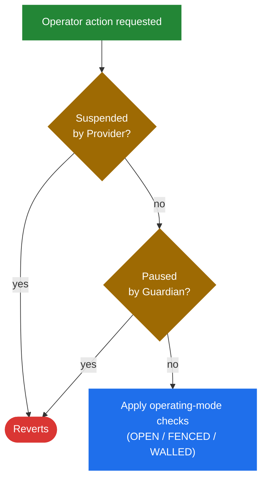

# Operating Modes

The operating mode is the central risk dial of a Makina Lite module. It decides how tightly the module constrains Operator actions on-chain, and it is the lever a Safe and the protocol use to widen or narrow Operator power, instantly and without redeploying.

## The 3 modes

The mode is one of three values, ordered by increasing restriction. The Safe sets it.

- `OPEN`. No additional restrictions are enforced beyond instruction Merkle verification (which is always on). This is the trusted-operator mode.
- `FENCED`. Restrictions apply to the value-exit paths, swaps and bridge transfers: value loss limits, cooldowns, bridge recipient whitelisting, and bridge route or OFT registration checks. Position management is unaffected.
- `WALLED`. Everything `FENCED` enforces, plus restrictions on position management: mandatory accounting, value-preservation checks, and instruction cooldowns.

The restriction is monotonic. `WALLED` is a strict superset of `FENCED`, which is a strict superset of `OPEN`.

### What each mode enforces

| Check | OPEN | FENCED | WALLED |
| --- | :---: | :---: | :---: |
| Instruction Merkle proof verification | Yes | Yes | Yes |
| Swap value loss limit and cooldown | No | Yes | Yes |
| Bridge recipient whitelist, loss limit, cooldown, route/OFT registration | No | Yes | Yes |
| Position management: mandatory accounting | No | No | Yes |
| Position management: value-loss matrix, direction checks, and instruction cooldown | No | No | Yes |

## Two independent halts

The operating mode controls how actions are constrained when they run. Two separate switches control whether Operator actions run at all.

- **Paused** is set by a **Guardian**. It blocks all Operator actions.
- **Suspended** is set by the **Provider**. It also blocks all Operator actions.

The two are independent. Either one, on its own, stops Operator activity. Configuration functions (Safe-only) and the Provider's fee-rate setter are **not** blocked by either halt, so the Safe can keep retuning the module while it is paused or suspended.

## Why a dial instead of a fixed policy

Different strategies, and different moments in a strategy's life, need different amounts of trust.

- A freshly launched strategy with a small, well-understood instruction set, run by a closely held Operator, might run in `OPEN` for speed.
- A strategy that delegates execution to a third party, or one holding significant value, runs in `FENCED` or `WALLED` so that every value exit and position change is bounded by value-loss limits and rate-limited by cooldowns.

The dial lets the Safe move along that spectrum in one transaction, without changing the instruction set or redeploying.

:::tip[Next]
See how each layer of restriction works in [Position Management](/concepts/architecture/position-management), [Token Swaps](/concepts/architecture/swaps), and [Token Bridging](/concepts/architecture/bridging).
:::
