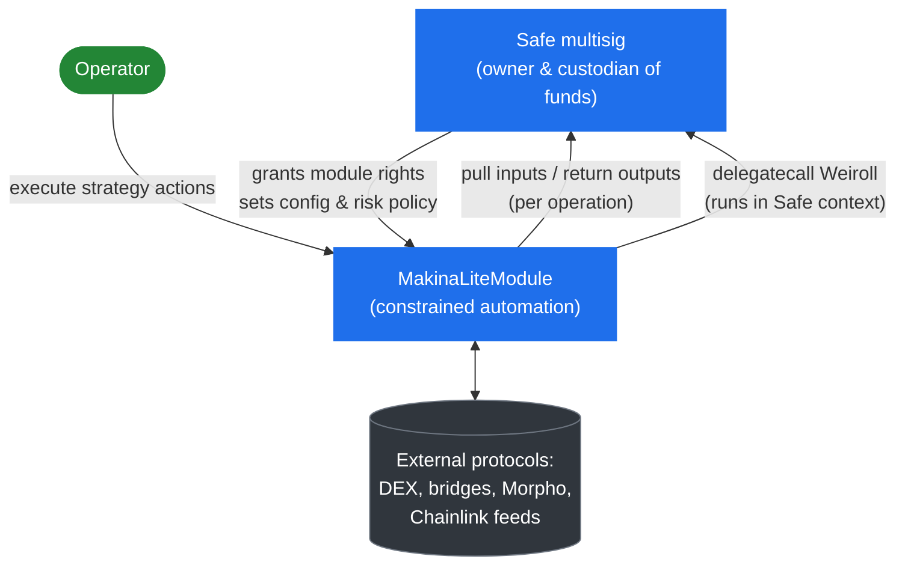
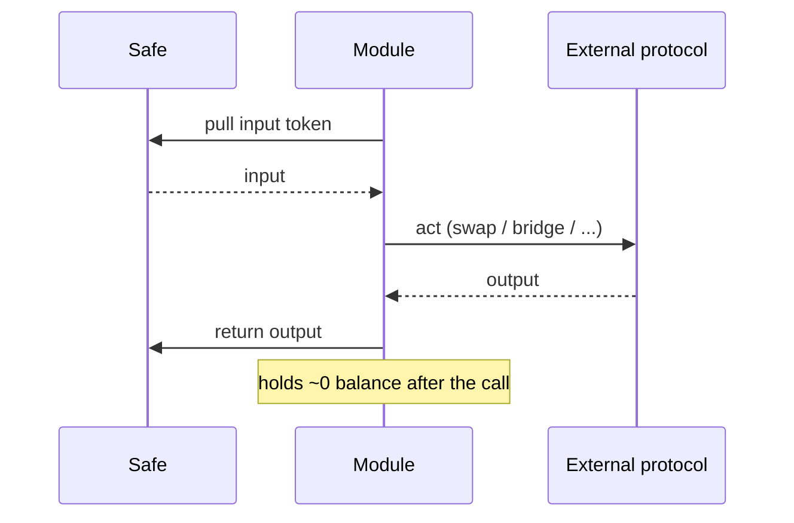

# Architecture

## The Safe and the module

Makina Lite is a single **`MakinaLiteModule`** installed on an existing **Safe** multisig. The Safe remains in the hands of its signers throughout. Installing the module grants it module-execution rights on the Safe, and nothing more.

- The **Safe** is the owner and custodian. It holds the tokens, sets every configuration and risk parameter, and can pause or disable the module. Module-execution rights are what let the module act for the Safe.
- The **module** is a constrained automation layer. It carries no funds in steady state. It pulls inputs from the Safe, performs an action, and returns the outputs to the Safe within the same transaction. Weiroll scripts run directly inside the Safe's own context by delegatecall.

A module operates on a single chain. Cross-chain movement is **outbound bridging only**: the module can send tokens to another chain, but it does not track, value, or reconcile assets on other chains. There is no cross-chain accounting.

## What the module composes

[`MakinaLiteModule`](/contracts/MakinaLiteModule.sol/contract.MakinaLiteModule) is the single concrete contract. It inherits a set of abstract components, each owning one responsibility:

| Component | Responsibility | Conceptual page |
| --- | --- | --- |
| **Weiroll position management** | Open, modify, close, and value positions through pre-approved Weiroll scripts run in the Safe context. | [Position Management](/concepts/architecture/position-management) |
| **Swap** | Execute token swaps through external DEX aggregators using operator-supplied calldata. | [Token Swaps](/concepts/architecture/swaps) |
| **Bridge** | Send outbound cross-chain transfers using the calldata and target provided by per-bridge encoders. | [Token Bridging](/concepts/architecture/bridging) |
| **Oracle registry** | Price tokens through Chainlink-compatible feeds, the backbone of every loss check. | [Pricing & Oracles](/concepts/architecture/pricing-oracles) |
| **Governable** | Module-level roles, the pause and suspend halts, and the operating mode. | [Permissions & Governance](/concepts/permissions-and-governance) |

Flash loans are handled by a separate shared contract, the [`FlashLoanModule`](/contracts/flash-loans/FlashLoanModule.sol/contract.FlashLoanModule), used only inside flash-loan-assisted position management. See [Flash-loan-assisted management](/concepts/architecture/position-management#flash-loan-assisted-management).

## Shared infrastructure

Some contracts are deployed once for a whole Makina Lite deployment and shared by every module.

- The [`MakinaLiteRegistry`](/contracts/registry/MakinaLiteRegistry.sol/contract.MakinaLiteRegistry) is the single source of truth for shared addresses: the factory, the module implementation used for cloning, the fee collector that receives swap fees, the `FlashLoanModule`, and the bridge encoders (indexed by bridge ID).
- The [`ModuleFactory`](/contracts/factory/ModuleFactory.sol/contract.ModuleFactory) deploys new modules as [ERC-1167](https://eips.ethereum.org/EIPS/eip-1167) minimal clones.
- The **Bridge Encoders** ([`AcrossV4BridgeEncoder`](/contracts/bridge-encoders/AcrossV4BridgeEncoder.sol/contract.AcrossV4BridgeEncoder), [`CctpV2BridgeEncoder`](/contracts/bridge-encoders/CctpV2BridgeEncoder.sol/contract.CctpV2BridgeEncoder), [`LayerZeroV2BridgeEncoder`](/contracts/bridge-encoders/LayerZeroV2BridgeEncoder.sol/contract.LayerZeroV2BridgeEncoder)) are singletons that build the bridge-specific calldata and hold per-bridge route and registration data.

These infrastructure contracts are upgradeable and use [OpenZeppelin AccessManager](https://docs.openzeppelin.com/contracts/5.x/api/access#AccessManager) for authorization, a separate trust domain from the per-Safe module roles. See [Permissions & Governance](/concepts/permissions-and-governance).

## Fund custody: the single chokepoint

The most important architectural fact in Makina Lite is that **the module does not hold funds**.

Every value-moving operation follows the same shape:

1. **Pull** the input token from the Safe (or run a Weiroll script directly in the Safe).
2. **Act** (swap, bridge, manage a position, repay a flash loan).
3. **Return** the output to the Safe within the same transaction.

All token movement out of the Safe through the module passes through a single internal pull function, or runs as a delegatecall inside the Safe. The module is meant to hold nothing between operations, but a few things can still land on it, such as dust from an integration or the small native-gas buffers some bridge transfers need (LayerZero, for example). Safe-only sweep functions let the Safe recover whatever does.

## Glossary

| Term | Meaning |
| --- | --- |
| **Safe** | The Gnosis Safe multisig that owns the funds and the module. The sole configuration authority. |
| **Module** | An instance of `MakinaLiteModule`, installed on one Safe. The constrained automation layer. |
| **Operator** | An address the Safe authorizes to execute strategy actions through the module. Holds no configuration power. |
| **Provider** | A protocol service account that sets the swap fee rate and can suspend the module. |
| **Guardian** | An address that can pause and unpause the module. The Safe is always a Guardian. |
| **Operating mode** | The dial (`OPEN`, `FENCED`, `WALLED`) that selects how tightly Operator actions are constrained. See [Operating Modes](/concepts/architecture/operating-modes). |
| **Instruction** | A pre-approved action, committed as a leaf in a Merkle tree, that an Operator may execute. See [Position Management](/concepts/architecture/position-management). |
| **Position** | A deployment of capital into an external protocol, tracked and valued by the module. Can be an asset or a debt. |
| **Accounting currency** | The token (or the reference currency) in which position values are expressed. See [Pricing & Oracles](/concepts/architecture/pricing-oracles). |
| **Reference currency** | The base unit of the oracle (for example USD), addressed as `address(0)`, in 18 decimals. |
| **Weiroll** | The command-chaining VM used to execute position management scripts inside the Safe by delegatecall. |
| **Bridge encoder** | A shared contract that builds the calldata for one external bridge protocol. |
| **Registry / Factory** | Shared infrastructure that resolves addresses and deploys modules. |

:::tip[Next]
Continue to [Operating Modes](/concepts/architecture/operating-modes) to understand the dial that governs every Operator action.
:::
