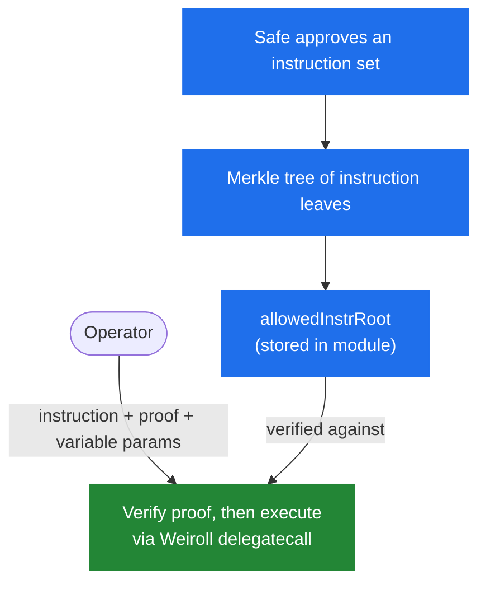
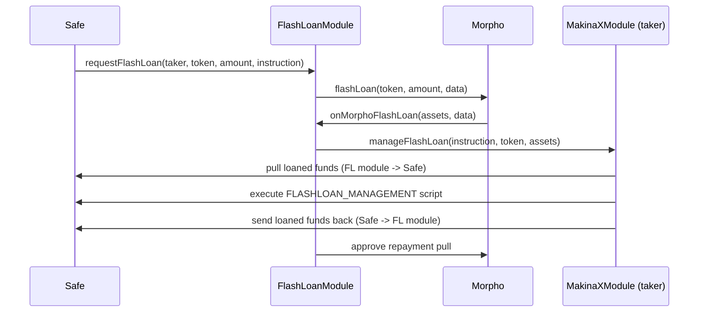
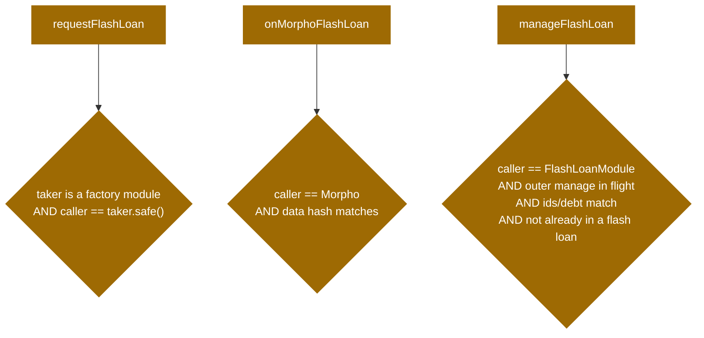

# Position Management

Position management is how a strategy actually deploys capital: opening, resizing, and closing positions in external protocols, and measuring what those positions are worth. It is the most security-critical part of MakinaX, because it runs operator-supplied scripts **inside the Safe** and is the path through which most value moves.

This page explains the mental model. For the exact validation rules, see [`WeirollComponent`](/contracts/module-components/abstract.WeirollComponent) and its interface [`IWeirollComponent`](/contracts/interfaces/interface.IWeirollComponent) in the Contracts reference.

## Weiroll scripts run inside the Safe

Position management uses [Weiroll](https://github.com/EnsoBuild/enso-weiroll), a command-chaining VM. When the module executes a position management script, it instructs the Safe to **delegatecall** the Weiroll VM. The script therefore runs in the Safe's own context, with the Safe's storage and balances.

This is what gives the module its flexibility. Rather than hard-coding an adapter for every protocol, the module can chain arbitrary external calls through Weiroll. It is also why authorization matters so much: a script runs with the Safe's full authority, so the only thing standing between an Operator and the Safe's funds is the pre-approval gate described below.

## Instructions and the Merkle root

An Operator cannot run an arbitrary script. Every script must correspond to an **instruction** that the Safe has pre-approved.

The Safe maintains a set of allowed instructions as the leaves of a Merkle tree and stores only the **root** in the module. To execute an instruction, the Operator supplies the instruction together with a Merkle proof. The module recomputes the leaf and verifies the proof against the stored root. Verification happens on every executed instruction, in every operating mode.

The leaf binds the instruction's identity: its commands, its fixed parameters, its position ID, its debt flag, its affected-token list (the tokens the instruction declares it touches), and its instruction type. Because these are committed in the leaf, a proof cannot be replayed as a different instruction type or against another position.

### Fixed and variable parameters

A single approved instruction often needs to run with different inputs over time (a varying amount, for example). MakinaX supports this with a **bitmap** on each instruction.

The bitmap marks which script state slots are **fixed** (their values are hashed into the leaf and committed in advance) and which are **variable** (excluded from the hash, so the Operator chooses them at call time). This lets one pre-approved instruction serve many parameterizations, while still pinning down everything the Safe wanted to pin down.

## The four instruction types

| Type                   | Purpose                                                                                                                                                                       |
| ---------------------- | ----------------------------------------------------------------------------------------------------------------------------------------------------------------------------- |
| `MANAGEMENT`           | Modifies the size of a position. In `WALLED` mode an associated `ACCOUNTING` instruction is required.                                                                         |
| `ACCOUNTING`           | Computes the token amounts used to value a position. Applies to the `MANAGEMENT` instructions for the matching position ID.                                                   |
| `HARVEST`              | Collects rewards earned by open positions from external protocols.                                                                                                            |
| `FLASHLOAN_MANAGEMENT` | Modifies a position inside a flash loan, always nested within an outer `MANAGEMENT` instruction. See [Flash-loan-assisted management](#flash-loan-assisted-management) below. |

## Accounting: how a position is valued

Valuing a position is a two-part design. The **script** reports token amounts, and the **module** owns the pricing.

An `ACCOUNTING` script runs and returns a list of amounts, one per affected token, terminated by an end-of-list sentinel. The module reads those amounts, prices each token in the accounting currency through the [oracle](/concepts/architecture/pricing-oracles), and sums them into a single position value. Because the module, not the script, applies the prices, a script cannot directly forge a value. It can only report amounts.

That separation has a sharp edge: if the reported amounts are derived from manipulable on-chain reads (a spot price, a manipulable reserve), the value can still be skewed. `ACCOUNTING` scripts are therefore assumed to be read-only and resistant to manipulation such as sandwiching. See the assumptions below.

## WALLED mode: value-loss checks

In `WALLED` mode, position management is economically bounded. After each `MANAGEMENT` script, the module compares two deltas:

- the change in **position value**, computed from an `ACCOUNTING` run before and after the script, and
- the change in the **Safe's balances** of the affected tokens, priced through the oracle.

The two are expected to move in opposite, consistent directions. For an **asset** position, spending tokens should increase the position value, and receiving tokens should accompany a decrease. For a **debt** position the token flow inverts (taking on debt brings tokens in, repaying it sends tokens out). The module checks that the observed combination is consistent and within the configured loss tolerance.

Two limits express the tolerance, one for each direction of the position value change:

- `maxPositionIncreaseLossBps` bounds the loss allowed when the position value increases.
- `maxPositionDecreaseLossBps` bounds the loss allowed when the position value decreases.

In both cases the position value change must stay within the configured tolerance of the affected-token flow it is paired with. That pairing is what inverts between asset and debt positions (as above), so the same two limits govern both.

Combinations that should be impossible (value dropped while spending into an asset position, debt grew while spending) are rejected outright as an invalid direction. Combinations where value appears to rise implausibly are capped, an anti-fabrication guard. The exact rules form a matrix over three booleans (token flow direction, debt flag, position-value direction). The authoritative version of that matrix lives in the [`IWeirollComponent`](/contracts/interfaces/interface.IWeirollComponent) `managePosition` documentation and in [`WeirollComponent`](/contracts/module-components/abstract.WeirollComponent).

Each side of this comparison is floored to the accounting currency's smallest unit, so up to one unit per affected or position token can be hidden inside an otherwise valid check. The rounding favors the operator, which is what makes the choice of accounting currency a risk decision, covered in the [Risk Model](/concepts/risk-model#economic-risks).

:::warning[The core limitation of value-loss checks]
These checks compare the **Safe's measured balances** before and after, so they cannot be robustly enforced for instructions that embed arbitrary operator-supplied calldata (such as a DEX aggregator call inside a management script). That calldata can hand control to a third party mid-execution, transiently inflating the measured balances and masking a real loss. **Whitelisting such instructions is therefore discouraged.**
:::

## Instruction cooldown

In `WALLED` mode, each successful `MANAGEMENT` script records a timestamp keyed by the tuple `(positionId, commands, direction)`, where direction reflects whether the operation increased or decreased the position value. Re-running the same script on the same position in the same direction is rejected until the configured cooldown has elapsed. Reversing direction, or running a different script, uses a different key and is not blocked. A cooldown of zero disables the check, and the first run for any key is never blocked.

## Flash-loan-assisted management

Some position management needs temporary capital that is borrowed and repaid in the same transaction, for example to unwind a leveraged position. MakinaX supports this through a shared `FlashLoanModule` that wraps [Morpho](https://morpho.org/) flash loans and hands the borrowed funds to a module's position-management logic.

Flash loan funds are only ever used by a `FLASHLOAN_MANAGEMENT` instruction, nested within an outer `MANAGEMENT` instruction. They are not a standalone Operator capability. For the exact mechanics, see [`FlashLoanModule`](/contracts/flash-loans/contract.FlashLoanModule) in the Contracts reference.

### The flow

A flash loan is initiated by the **Safe**, not the Operator, and it executes nested inside an in-flight `managePosition` call on the module.

1. The Safe calls `requestFlashLoan` on the `FlashLoanModule`, naming the taker module, the token, the amount, and the `FLASHLOAN_MANAGEMENT` instruction.
2. The `FlashLoanModule` requests the loan from Morpho.
3. Morpho calls back `onMorphoFlashLoan` on the `FlashLoanModule`.
4. The `FlashLoanModule` delegates to the taker module's `manageFlashLoan`.
5. The taker module pulls the loaned funds from the `FlashLoanModule` into the Safe.
6. The taker executes the `FLASHLOAN_MANAGEMENT` script in the Safe.
7. The taker instructs the Safe to send the repayment back to the `FlashLoanModule`, which then repays Morpho.

As with all execution, the borrowed funds transit to the Safe because that is where Weiroll scripts run.

### How the flow is authorized

The flash-loan path crosses several contracts and re-enters the module, so its authorization is layered.

- **Only a genuine module's own Safe can borrow.** `requestFlashLoan` checks that the named taker is a module the `ModuleFactory` deployed, and that the caller is that taker's Safe. A forged taker, or a caller that is not the taker's Safe, is rejected.
- **Only Morpho can trigger the callback.** `onMorphoFlashLoan` accepts calls only from the configured Morpho address.
- **The callback data is bound to the request.** When the loan is requested, the `FlashLoanModule` stores a hash of the request data in transient storage. The callback must present data that hashes to the stored value, and the slot is single-use.
- **Nested management must be inside an in-flight outer management.** `manageFlashLoan` only proceeds if a `managePosition` call is currently in flight (tracked by a transient managed-position ID), if the caller is the registry's `FlashLoanModule`, if the position ID and debt flag match the outer position, and if the flash-loan instruction's debt flag is false. A direct call to `manageFlashLoan` outside an outer management reverts.

:::note[Morpho fee assumption]
The module re-approves Morpho for exactly the borrowed `assets`, assuming Morpho flash loans are fee-free (repayment equals principal). This matches Morpho's design. The borrowed amount itself is trusted from Morpho's callback rather than independently re-derived from the request. See the [Risk Model](/concepts/risk-model).
:::

## Assumptions the Safe must uphold

Some assumptions are always required for correct behavior. Others matter only in `WALLED` mode but remain good practice. They are enforced by the Safe's choice of what to whitelist, not by the contracts.

- Each instruction's `affectedTokens` list must be set correctly. A `MANAGEMENT` script must list every token it spends, and an `ACCOUNTING` script exactly the tokens the position value is expressed in. The list is ignored for `HARVEST`, and for `FLASHLOAN_MANAGEMENT`, which is instead bounded by its outer `MANAGEMENT` instruction's list.
- `ACCOUNTING` scripts must not change position state or token balances, must be resistant to third-party manipulation, and must output an ordered amounts list (one per affected token) followed by the end sentinel.
- `MANAGEMENT` and `FLASHLOAN_MANAGEMENT` scripts should not leave persistent ERC-20 approvals from the Safe to external contracts. Any approval granted during execution should be consumed or revoked before the script returns.
- `HARVEST` scripts should be receive-only and should not spend tokens the Safe already holds. The module applies no value-loss check to the harvest instruction itself, only to the swaps that may follow it, so this assumption is the only bound on a harvest.

:::tip[Next]
For how positions are priced, see [Pricing & Oracles](/concepts/architecture/pricing-oracles).
:::
