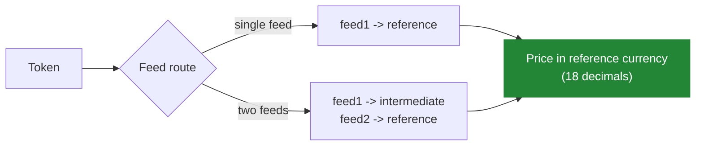

# Pricing & Oracles

The swap loss limit and the `WALLED` position value-loss checks both rest on a single pricing layer: the [`OracleRegistry`](/contracts/module-components/OracleRegistry.sol/abstract.OracleRegistry). (The bridge loss limit is the exception. It compares amounts directly, without the oracle, as explained in [Token Bridging](/concepts/architecture/bridging).) If pricing is wrong, the loss checks that depend on it are silently weakened. This page explains how the oracle works and where its assumptions lie.

## Feed routes

The oracle prices a token through a **feed route**: either a single Chainlink-compatible price feed, or a two-feed path (for example `TOKEN to ETH` then `ETH to USD`). Each route is configured by the Safe. A token is considered priceable only if it has a registered route.

Prices are expressed in a **reference currency** with 18 decimals (for example USD). Supported token decimals are constrained to the range 6 to 18 when a route is registered, which the exponent arithmetic in the pricing math relies on.

## Reference currency vs accounting currency

By default, position values are expressed in the reference currency. A module can optionally set an **accounting currency**, a specific token, in which case position values are expressed in that token using the oracle's cross-token pricing (the base token's route divided by the accounting token's route). The accounting currency can only be set to a token whose feed route is already registered, which prevents pricing a position against a token the oracle cannot value.

## Where pricing is used

- **Position valuation** during accounting (the per-token amounts an `ACCOUNTING` script reports are priced and summed).
- **Swap value-loss enforcement** in `FENCED` or `WALLED` mode.
- **Position value-loss enforcement** in `WALLED` mode.

## Staleness

Each feed has a configured staleness threshold, a maximum age in seconds. A feed whose latest update is older than its threshold causes pricing through it to revert. This is a safety property: a stale feed fails closed (the operation reverts) rather than pricing against outdated data. A threshold of zero is not "never stale" but the opposite. It disables the feed, because every read is then treated as stale and reverts.

## Assumptions and edges to know

- **A negative feed answer reverts.** A feed reporting a negative price is rejected.
- **A zero feed answer is not rejected.** A feed returning zero yields a zero valuation, which propagates as zero value into accounting and loss checks. This is an oracle-integrity assumption to be aware of when selecting feeds.
- **Feeds are trusted black boxes.** The oracle trusts each feed's reported answer, decimals, and update time. Loss checks are only as sound as the feeds behind them.
- **Shared feeds share one threshold.** A feed used by more than one token route has a single global staleness threshold. The last writer wins.
- **Two-feed routes multiply before dividing.** A two-feed route multiplies the raw answers before the final division into the accounting currency. Extreme-decimal or extreme-price feeds are where this integer math deserves the most scrutiny.
- **Never register a feed for a position token.** A token that represents a position in an external protocol (an Aave aToken, for example) must not have a feed route. With one, an Operator could route it through the swap loss check while the swap destroys far more value indirectly, such as by removing collateral and triggering a later liquidation.

:::tip[Next]
See how these prices feed the guards in [Token Swaps](/concepts/architecture/swaps) and [Position Management](/concepts/architecture/position-management), and how the whole pricing layer factors into the [Risk Model](/concepts/risk-model).
:::
