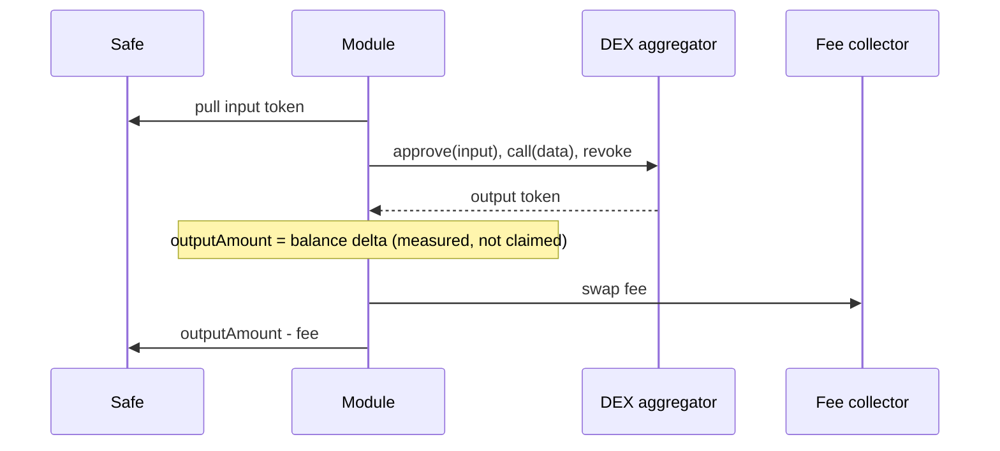

# Token Swaps

A strategy can swap tokens through external DEX aggregators. As elsewhere in Makina Lite, the swap component measures the realized output rather than trusting what the aggregator reports. In `FENCED` and `WALLED` mode it additionally bounds that output against an oracle-priced fair value. For the exact rules, see [`SwapComponent`](/contracts/module-components/SwapComponent.sol/abstract.SwapComponent) in the Contracts reference.

## How a swap runs

The Operator submits a swap order naming a registered swapper, an input token and amount, an output token and a minimum output, plus raw `data` to execute. The module then:

1. pulls the input token from the Safe onto the module,
2. approves the swapper's **approval target** for exactly the input amount,
3. executes the order's calldata against the swapper's **execution target**,
4. revokes the approval back to zero,
5. measures the realized output as its own balance change,
6. charges the swap fee, and
7. returns the remaining output to the Safe.

## Registered swappers

A swapper is a pair of addresses configured by the Safe: an **approval target** (which the module approves to pull the input) and an **execution target** (where the order calldata runs). They may differ, because some routers hold allowances at a separate address. Both must be set and non-zero for a swap to run.

The Operator chooses which registered swapper to use and supplies the route calldata, but cannot introduce a new target. The set of swappers is part of the Safe's pre-approval surface.

## Why the output is measured, not trusted

The aggregator is treated as a black box. The module never believes the amount the aggregator claims to have delivered. It records the output token balance before the external call and after, and takes the difference as the realized output. That delta is the only trusted measure. If it is below the order's `minOutputAmount`, the swap reverts.

This is the same principle as everywhere in Makina Lite: bound the outcome, not the input. Arbitrary route calldata is allowed because encoding every aggregator's ABI on-chain is infeasible, so the module accepts the operator's route and checks what actually came back.

## Mode-gated guards

In `FENCED` or `WALLED` mode, two guards apply.

- **Value loss limit.** The module prices the realized output against the input through the oracle and requires it to be within `maxSwapLossBps` of the input value. This catches routes that technically clear `minOutputAmount` but still leak value relative to a fair price.
- **Cooldown.** Swaps are rate-limited by a single global cooldown, not segmented by swapper or token. A harvest settles its reward swaps through this same path, so a harvest carrying more than one swap order needs `OPEN` mode or a swap cooldown of zero.

## Fees

The [Provider](/concepts/permissions-and-governance) can set a swap fee rate on any module. That rate applies to every swap output, and fees are sent to the fee collector address stored in the registry. The fee is charged after the value-loss check, so the effective worst-case loss on a guarded swap is roughly `maxSwapLossBps` plus the fee rate.
