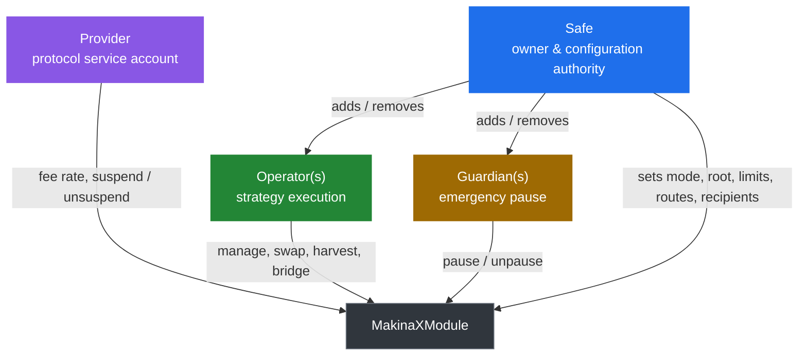

# Permissions & Governance

MakinaX has two distinct access-control systems, and keeping them separate is essential to understanding the trust model.

- **Module-level roles** govern a single [`MakinaXModule`](/contracts/contract.MakinaXModule) and its Safe. They are simple address mappings and modifiers, implemented in [`MakinaXGovernable`](/contracts/utils/abstract.MakinaXGovernable).
- **Infrastructure roles** govern the shared contracts (`MakinaXRegistry`, `ModuleFactory`, and the bridge encoders) through an [OpenZeppelin AccessManager](https://docs.openzeppelin.com/contracts/5.x/api/access#AccessManager).

The two domains meet only at well-defined seams: modules read shared addresses from the registry, the factory mints modules, and bridge encoders read the calling module's operating mode.

The authoritative, exhaustive list of powers is `PERMISSIONS.md` in the protocol repository. This page is the conceptual model.

## Module-level roles

### Safe

**Fully trusted.** The Safe is the ultimate owner of the module and all managed assets, and the sole authority over configuration and risk parameters. Its powers include adding and removing operators and guardians, setting the operating mode, setting the allowed instruction root, setting the accounting currency and price feed routes, setting every loss limit and cooldown (position, swap, bridge), setting swapper targets, whitelisting bridge recipients, and sweeping tokens or native balance back to itself.

The Safe is **always a Guardian** and cannot remove itself from that role, so the owner can always pause. The Safe is set at initialization and is the trust anchor of the module.

### Provider

**Fully trusted.** The Provider is the protocol's service account. It sets the swap fee rate, can suspend and unsuspend the module, and can transfer its own role to a new address. It cannot change strategy configuration, and it cannot move funds the Safe already holds or block the Safe from reaching them. It is, however, fully trusted for swap proceeds: the fee rate can be set as high as 100% and applies to the output after the loss check, so the Provider can in principle capture a swap's entire output. It is a service-level actor, not an owner.

### Operators

**Partially trusted in `FENCED` and `WALLED`, fully trusted in `OPEN`.** Operators execute strategy actions: accounting, position management, swaps, harvests, and outbound bridge transfers. They hold no configuration power, and every action requires the module to be operational (not paused, not suspended). Operators supply raw calldata, which the module treats as adversarial and bounds by Merkle gating and the mode guards.

### Guardians

**Partially trusted.** Guardians are emergency contacts that can pause and unpause the module. The Safe is a permanent Guardian, and additional guardians can be added and removed by the Safe.

## Infrastructure roles

All protocol-wide restricted actions are gated by a single `AccessManager` per chain, shared with the Makina Core protocol. The addresses holding these roles are fully trusted.

Each role can carry an **execution delay** (a timelock between scheduling a restricted action and executing it) and a **guardian** that can cancel a scheduled action during that window. MakinaX shares this infrastructure control plane with the wider Makina deployment, so the holders, delays, and guardian assignments match those of the production AccessManager.

| Role | id | Authority in MakinaX | Holder, execution delay |
| --- | --- | --- | --- |
| `ADMIN_ROLE` | 0 | Super admin of the AccessManager: configure roles, delays, and guardians. Has **no guardian**, so its actions cannot be cancelled by anyone else. | Deployment factory: no delay (at setup) DAO: 2-day delay |
| `INFRA_CONFIG_ROLE` | 1 | Configure the registry (factory, implementation, fee collector, flash-loan module, bridge encoder addresses) and the bridge encoders (routes, CCTP domains, endpoint IDs, OFTs). | DAO: 1-day delay |
| `STRATEGY_DEPLOYMENT_ROLE` | 2 | Deploy new modules via the `ModuleFactory`. | DAO: no delay |
| `INFRA_UPGRADE_ROLE` | 6 | Upgrade the infrastructure proxies through the associated ProxyAdmin. | DAO: 2-day delay |
| `GUARDIAN_ROLE` | 7 | Cancel operations scheduled under any other role. It is the guardian of every role except `ADMIN_ROLE`. | Security Council: no delay |

These powers are protocol-wide. A change to a shared address or an encoder registration affects every module that uses it.

Modules are deployed through the `ModuleFactory` by an address holding `STRATEGY_DEPLOYMENT_ROLE`. There is a single deployment entry point, and every service parameter, including the initial provider and swap fee rate, is supplied by the caller at deployment.

:::note[How the infrastructure timelock works]
Operations under a role with a non-zero delay are queued and visible on-chain during the delay window, where the role's guardian (the Security Council, holding `GUARDIAN_ROLE`) can cancel them. `ADMIN_ROLE` has no guardian, so its delay is the only on-chain barrier on admin operations. This matches the production Makina AccessManager.
:::

## Upgradeability

- **Modules** are ERC-1167 minimal clones of a fixed implementation. Each clone binds its implementation in its own bytecode. Changing the registry's `moduleImplementation` affects only **future** clones, never existing modules.
- **Infrastructure contracts** (registry, factory, encoders) are upgradeable proxies, upgraded by the `INFRA_UPGRADE_ROLE`.

:::tip[Next]
See how these roles and powers translate into concrete risks in the [Risk Model](/concepts/risk-model).
:::
