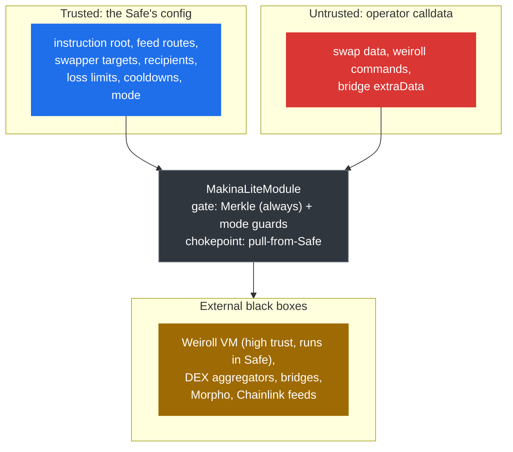

# Risk Model

This page maps the risks a Makina Lite deployment carries: where they come from, what bounds them, and what assumptions must hold. It is written for auditors, integrators, and Safe owners deciding how to configure a module. It does not enumerate vulnerabilities. It frames the threat surface.

The guiding principle throughout Makina Lite is **bound the outcome, not the input**. Operators supply adversarial calldata. The contracts do not validate that calldata. They constrain authorization (Merkle gating) and measured results (loss limits, minimum outputs, cooldowns). The risks below are best understood as the places where that bounding is incomplete or rests on an assumption.

## Trust boundaries

## Environment and token assumptions

The whole threat model rests on assumptions about the environment a module runs in.

- **The Safe is a stock Safe.** The deployed Safe is assumed to be an unmodified Gnosis Safe (v1.4.1 or later) with the Makina Lite module enabled and no other modules or guards installed.
- **Tokens are well-behaved.** Tokens used as instruction inputs, swap inputs, bridge inputs, or oracle quote tokens are assumed to be standard ERC-20 contracts with 6 to 18 decimals, no rebasing, no transfer hooks, and no fee on transfer. The balance-delta guards and the direct bridge amount comparison both rely on this.

## Technical risks

- **The Weiroll VM is the highest-trust dependency.** Position management runs by delegatecall with the Safe's full authority. The VM address is fixed at the implementation's construction and shared across clones, so it cannot be repointed. See [Position Management](/concepts/architecture/position-management#weiroll-scripts-run-inside-the-safe).
- **Balance-delta measurement can be gamed.** Both swap-output measurement and the `WALLED` position value-loss check read the Safe's balances before and after an external call, so a token that transiently inflates those balances can mask a real loss. This is the protocol's core limitation and the reason instructions embedding arbitrary calldata should not be whitelisted. See [Position Management](/concepts/architecture/position-management#walled-mode-value-loss-checks).
- **Arbitrary swap and bridge calldata.** Swaps and bridges run operator-supplied calldata against configured targets, bounded by output measurement, the minimum output, the loss check, and the rule that a swap target cannot be the Safe. See [Token Swaps](/concepts/architecture/swaps).
- **The flash-loan state machine.** `manageFlashLoan` is re-enterable by design and guarded by transient state rather than a reentrancy lock, with authorization layered across the module, the `FlashLoanModule`, and Morpho. See [Flash-loan-assisted management](/concepts/architecture/position-management#flash-loan-assisted-management).
- **Accounting output decoding.** Position value is decoded from the Weiroll output as amounts terminated by a `type(uint256).max` sentinel, which the protocol assumes a real amount never equals. See [Accounting](/concepts/architecture/position-management#accounting-how-a-position-is-valued).

## Economic risks

- **Oracle-priced loss limits are only as good as the oracle.** The swap and `WALLED` position checks price value through the [oracle](/concepts/architecture/pricing-oracles), so a mispriced feed silently weakens them. The bridge loss check is the exception, comparing amounts directly and instead assuming input and output tokens are homologous.
- **`OPEN` mode drops the economic guards.** Only Merkle gating remains, so value protection rests entirely on the instruction set and swappers the Safe has approved. See [Operating Modes](/concepts/architecture/operating-modes).
- **Swap fees are taken after the loss check.** The fee can be set as high as 100% and applies to the output after the loss check, so the effective worst-case loss on a guarded swap is roughly `maxSwapLossBps` plus the fee rate, and the Provider is fully trusted for swap proceeds. The fee collector is a shared registry address, so an unset, wrong, or token-blacklisted fee collector makes guarded swaps with a non-zero fee revert across every module using that registry, a liveness issue rather than a loss. See [Token Swaps](/concepts/architecture/swaps#fees).
- **Cooldowns trade liveness for safety.** Misconfigured cooldowns can block legitimate activity, and the global swap cooldown in particular interacts with multi-swap harvests. See [Token Swaps](/concepts/architecture/swaps#mode-gated-guards).
- **The `WALLED` check rounds in the operator's favor.** The tolerated leak scales with the value of one accounting-currency unit, so a high-value, low-decimal currency such as WBTC widens it, and it compounds across many tokens and repeated calls. Prefer a high-decimal accounting currency, and run off-chain monitoring of total Safe value to catch a compromised operator that the on-chain checks alone would miss. See [Position Management](/concepts/architecture/position-management#walled-mode-value-loss-checks).

## Oracle assumptions

Every oracle-priced guard inherits the oracle's integrity assumptions: honest Chainlink-compatible feeds, a zero answer accepted as zero value, a zero staleness threshold disabling a feed, supported decimals of 6 to 18, no feed registered for a position token, and the integer-math edges of two-feed routes. These are detailed in [Pricing & Oracles](/concepts/architecture/pricing-oracles#assumptions-and-edges-to-know).

## Governance risks

- **The Safe is the single most powerful actor.** Compromise of the Safe is compromise of the module's entire strategy execution, bounded only by the instruction root the Safe itself set. There is no module-level timelock, so the Safe's multisig threshold is the defense.
- **Mode downgrade is instant.** Moving from `WALLED` to `OPEN` removes every economic guard in one transaction. See [Operating Modes](/concepts/architecture/operating-modes).
- **Infrastructure compromise is protocol-wide but time-bounded.** The shared `AccessManager` roles control singletons (encoders, fee collector, flash-loan module, implementation) that every module relies on, so their blast radius spans the whole deployment. The configuration and upgrade roles carry execution delays during which the Security Council can cancel, while `ADMIN_ROLE` carries a delay but no guardian. See [Infrastructure roles](/concepts/permissions-and-governance#infrastructure-roles).
- **Provider availability.** The Provider role can be transferred to an unusable address, after which the fee, suspend, and unsuspend functions can no longer be called.

## Integration risks

- **Registry to FlashLoanModule coupling.** The registry's `flashLoanModule` must equal the deployed `FlashLoanModule` that Morpho calls back, or flash loans revert. This is a deployment invariant.
- **Bridge registration is shared state.** Across routes, CCTP domains, and LayerZero endpoint IDs and OFTs live in shared encoders managed by `INFRA_CONFIG_ROLE`. A wrong registration affects every module using that bridge.
- **CCTP does not re-read the operating mode.** Unlike Across and LayerZero, the CCTP encoder relies on domain registration plus the component-level whitelist, loss, and cooldown, rather than re-checking the caller's mode.
- **Bridging can be griefed.** There is no upper bound on `minOutputAmount`, so a compromised operator can set it unsatisfiably high, guaranteeing no solver fills the transfer and denying the Safe the ability to bridge until the order expires and refunds. This is an accepted liveness risk.
- **Outbound bridging is fire-and-forget.** The module does not track destination-chain outcomes. Once a transfer leaves, settlement is the bridge's responsibility.

## External dependencies

| Dependency | Used for | Trust posture |
| --- | --- | --- |
| **Enso Weiroll VM** | Position management execution (delegatecall in Safe) | High trust, immutable address |
| **DEX aggregators** | Swaps | Black box, bounded by output measurement and loss check |
| **Across V4, CCTP V2, LayerZero V2** | Outbound bridging | Black box, bounded by whitelist, loss, registration |
| **Morpho** | Flash loans | Trusted for `assets` and fee-free repayment |
| **Chainlink-compatible feeds** | All pricing | Trusted for answer, decimals, freshness |
| **Safe** | Custody and module execution | Fully trusted owner |
| **OpenZeppelin AccessManager** | Infrastructure authorization | Trusted infra control plane |

:::tip[Next]
For the parameters that configure these guards, see [Configure the Makina Lite Module](/configure).
:::
