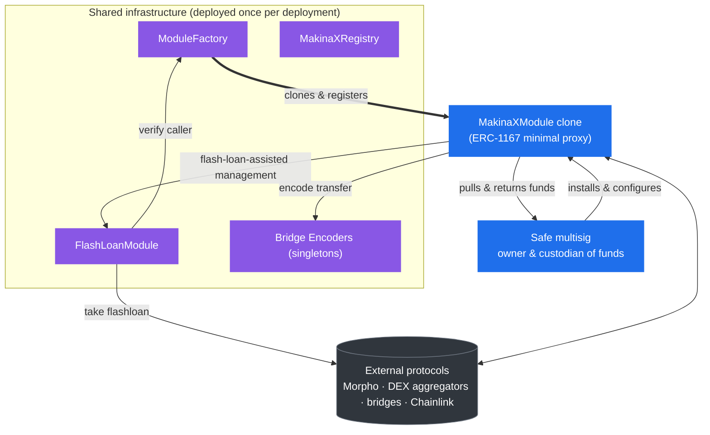

# Contracts

This section is the reference for the MakinaX smart contracts: the core [`MakinaXModule`](/contracts/MakinaXModule.sol/contract.MakinaXModule), its module components (position management, swaps, bridging, and the oracle registry), the shared infrastructure ([`MakinaXRegistry`](/contracts/registry/MakinaXRegistry.sol/contract.MakinaXRegistry), [`ModuleFactory`](/contracts/factory/ModuleFactory.sol/contract.ModuleFactory), [`FlashLoanModule`](/contracts/flash-loans/FlashLoanModule.sol/contract.FlashLoanModule)), and the bridge encoders.

## Architecture Overview

The shared infrastructure is deployed once per MakinaX deployment. The [`ModuleFactory`](/contracts/factory/ModuleFactory.sol/contract.ModuleFactory) reads the implementation address from the [`MakinaXRegistry`](/contracts/registry/MakinaXRegistry.sol/contract.MakinaXRegistry) and deploys each module as an [ERC-1167](https://eips.ethereum.org/EIPS/eip-1167) minimal clone that delegatecalls into the [`MakinaXModule`](/contracts/MakinaXModule.sol/contract.MakinaXModule) implementation. Each clone is installed on its own Safe and resolves the rest of its dependencies (the [`FlashLoanModule`](/contracts/flash-loans/FlashLoanModule.sol/contract.FlashLoanModule), the bridge encoders, the fee collector) through the registry at runtime.

For the conceptual model behind these contracts, start with the [Concepts](/concepts/introduction) section. For onchain addresses, see [Deployments](/contracts/deployments).
